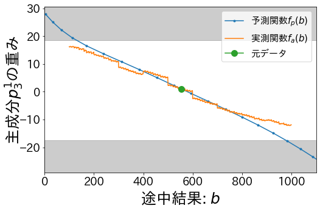
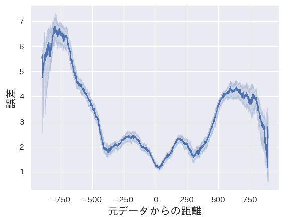

# ニューラル数式ソルバーにおける途中結果の追跡と操作

## 環境構築
以下のコードを実行する。
```bash
$ mkdir data data-bin models
$ pip install -r requirements.txt
```


## データセットの作成
次のコードで四則演算のデータセットを作成できる。
```bash
$ python gen_tree_arithmetic_data.py --num_samples 2e5 --num_dev_samples 1e4 --num_limit 1000 --num_limit_min 1 --depth 4 #訓練、検証用
$ python gen_tree_arithmetic_data.py --num_samples 1e3 --num_dev_samples 1e3 --num_limit 1000 --num_limit_min 100 --depth 2 --short --sub #モデル分析用
```
データセットの生データは`data/`にjsonlファイルで保存される。

## 前処理
次のコードで生データをモデルに学習可能な形にバイナリ化することができる。
```bash
$ ./preprocess_from_jsonl.sh data/{RAW_DATA}.jsonl {TOKEN_NUM}
```
バイナリ化されたデータセットは`data-bin/`に保存される。

## モデルの訓練
以下のコードでニューラル数式ソルバーを訓練できる。
```bash
CUDA_VISIBLE_DEVICES=1 python train_2type.py --examples_n_features_dir data-bin/{EXAMPLES_DIR_train} --train_batch_size 64 --model_dir {MATH_SOLVER} --model_dir_pt {CHECKPOINTS_DIR} --num_train_epoch 5 --lr 5e-5
```
モデルの情報は`models/{MATH_SOLVER}/`に保存される。`--model_dir_pt `を指定した場合、チェックポイントファイルだけは`{CHECKPOINTS_DIR}/{MATH_SOLVER}`に保存される。

## 途中結果の追跡 (Tracing)
モデルの隠れ層と数式中の途中結果の関係を可視化する。(詳しくは論文を参照)
```
CUDA_VISIBLE_DEVICES=1 python making_correlation_heatmap_tree.py --examples_n_features_dir data-bin/{EXAMPLES_DIR_analysis} --model_dir models/{MATH_SOLVER} --model_dir_pt {CHECKPOINTS_DIR} --num_features 10 --fixed_end 50 --together --annot --index a b c b-c a-\(b-c\)
```
).png)
## 途中結果の操作 (Manipulation)
主成分に沿ってアクティベーションを動かし、モデルの因果推論を行う。
```bash
CUDA_VISIBLE_DEVICES=0 python causal_inference.py --examples_n_features_dir data-bin/{EXAMPLES_DIR_analysis} --model_dir models/{MATH_SOLVER} --model_dir_pt {CHECKPOINTS_DIR} --fixed_end 50 --num_features 10 --eliminate_layer 1 --eliminate_k 3 --idx 20 --target_arg b
```


次のコードでデータセット全体におけるManipulationの精度を可視化できる。
```bash
CUDA_VISIBLE_DEVICES=0 python evaluation_inputs_activation_change.py --examples_n_features_dir data-bin/{EXAMPLES_DIR_analysis}  --model_dir models/{MATH_SOLVER} --model_dir_pt {CHECKPOINTS_DIR} --num_features 10  --fixed_end 50 --eliminate_layer 1 --eliminate_k 3  --target_arg b
```


[def]: figures/pca_relation_heatmap_alllay
